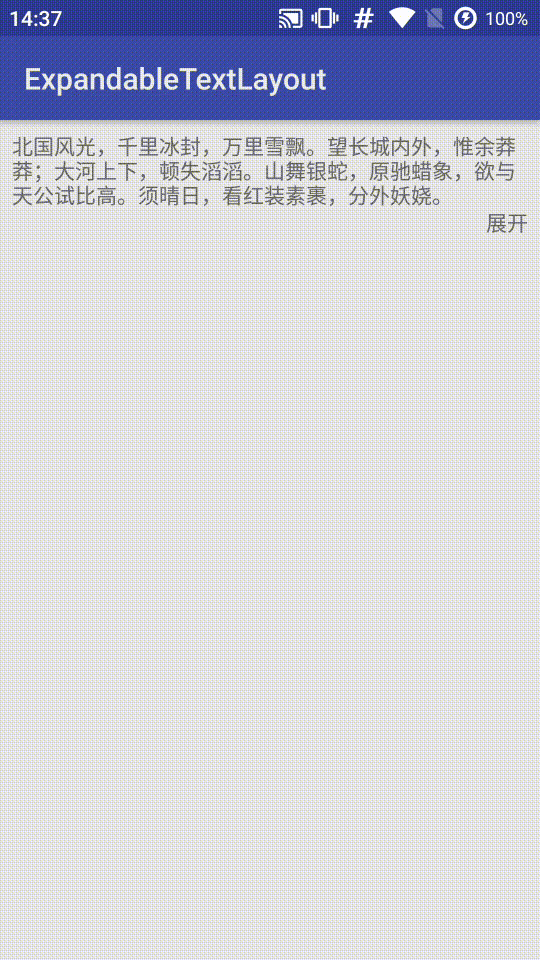

# ExpandableTextLayout

[](https://jitpack.io/#zerdaket/ExpandableTextLayout)





## Requirements

API Level 14 (IceCreamSandwich) and above.

## Installation

Gradle:

Step 1. Add it in your root build.gradle at the end of repositories:
```
allprojects {
	repositories {
		...
		maven { url 'https://jitpack.io' }
	}
}
```
Step 2. Add the dependency

```
dependencies {
	implementation 'com.github.zerdaket:ExpandableTextLayout:latest-version'
}

```
Maven:

Step 1. Add the JitPack repository to your build file
```
<repositories>
	<repository>
		<id>jitpack.io</id>
		<url>https://jitpack.io</url>
	</repository>
</repositories>
```
Step 2. Add the dependency
```
<dependency>
	<groupId>com.github.zerdaket</groupId>
	<artifactId>ExpandableTextLayout</artifactId>
	<version>latest-version</version>
</dependency>

```
## Usage

Add `ExpandableTextLayout` as a container to the TextView you want to make expandable:
```
<com.zerdaket.expandable.ExpandableTextLayout
	android:id="@+id/expandable_text_layout"
	android:layout_width="match_parent"
	android:layout_height="wrap_content"
	app:collapsedLines="3"
	app:animationDuration="200"
	app:toggleExpandedText="expand"
	app:toggleCollapsedText="collapse"
	app:toggleTextAppearance="@style/...">

	<TextView
		android:id="@+id/content_text"
  		android:layout_width="match_parent"
  		android:layout_height="wrap_content"/>

</com.zerdaket.expandable.ExpandableTextLayout>
```

## License

```
MIT License

Copyright (c) 2017 zerdaket

Permission is hereby granted, free of charge, to any person obtaining a copy
of this software and associated documentation files (the "Software"), to deal
in the Software without restriction, including without limitation the rights
to use, copy, modify, merge, publish, distribute, sublicense, and/or sell
copies of the Software, and to permit persons to whom the Software is
furnished to do so, subject to the following conditions:

The above copyright notice and this permission notice shall be included in all
copies or substantial portions of the Software.

THE SOFTWARE IS PROVIDED "AS IS", WITHOUT WARRANTY OF ANY KIND, EXPRESS OR
IMPLIED, INCLUDING BUT NOT LIMITED TO THE WARRANTIES OF MERCHANTABILITY,
FITNESS FOR A PARTICULAR PURPOSE AND NONINFRINGEMENT. IN NO EVENT SHALL THE
AUTHORS OR COPYRIGHT HOLDERS BE LIABLE FOR ANY CLAIM, DAMAGES OR OTHER
LIABILITY, WHETHER IN AN ACTION OF CONTRACT, TORT OR OTHERWISE, ARISING FROM,
OUT OF OR IN CONNECTION WITH THE SOFTWARE OR THE USE OR OTHER DEALINGS IN THE
SOFTWARE.
```